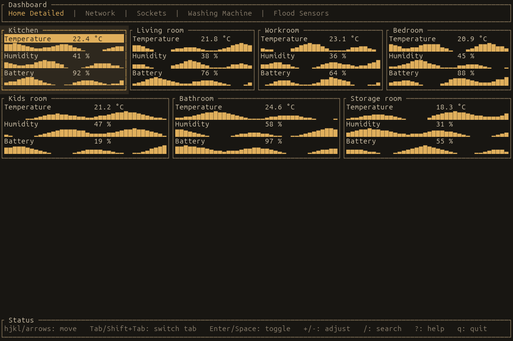
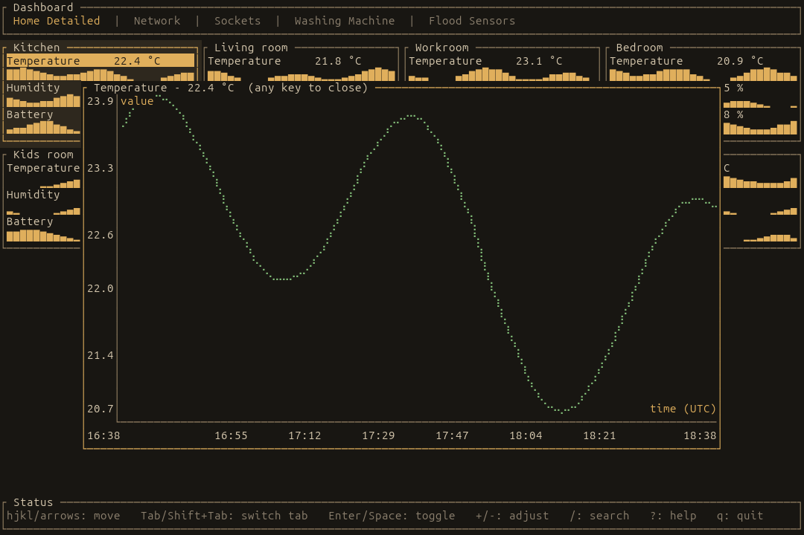

<p align="center">
  
  
  
  
  
</p>

<h1 align="center">ha-tui</h1>

<p align="center">
  <b>A fast, keyboard-driven terminal client for Home Assistant</b><br>
  Built with <a href="https://github.com/ratatui-org/ratatui">ratatui</a> + <a href="https://github.com/snapview/tokio-tungstenite">tokio-tungstenite</a>
</p>

<br>

ha-tui mirrors your existing Lovelace dashboards straight into your terminal — tabs, cards, and all — over Home Assistant's WebSocket API. Watch live entity states, flip switches, and glance at history sparklines without opening a browser tab.

No web server, no browser, no polling REST endpoints. Just a single binary and a WebSocket connection.

## Screenshots

<table>
<tr><td colspan="2">

**Overview** — mirrored Lovelace dashboard, card grid with live states and history sparklines


</td></tr>
<tr><td colspan="2">

**Detail popup** — press `Enter` on a card for a full time-axis history chart


</td></tr>
</table>

## Features

- **Lovelace mirroring** — imports your dashboard's views and cards on startup (`import_lovelace = true`), so tabs and card grids match what you already built in HA; falls back to a config-defined layout when disabled
- **Live state, live control** — entity states update in real time over the WebSocket event stream; toggle switches, lights, and other controllable entities directly from the grid
- **History sparklines** — numeric sensors render an inline sparkline pulled from `history/history_during_period`; press `Enter` on a card for a full detail popup with a real time-axis chart
- **2D panel navigation** — arrow keys move through the card grid spatially (up/down/left/right), not just in list order
- **Multi-dashboard tabs** — switch between views (Overview, Network, Climate, whatever your Lovelace config defines) with animated tab transitions
- **Smart title grouping** — cards sharing a common leading word (e.g. multiple `Washer: ...` sensors) are grouped under one panel title automatically
- **Masonry & sections layouts** — understands both classic Lovelace `cards` and the newer `sections` dashboard format

## Installation

### Requirements
- A running Home Assistant instance with the WebSocket API reachable
- A long-lived access token (Profile → Security → Long-Lived Access Tokens in HA)

### From source

```bash
git clone https://github.com/naqoyqatsi83/ha-tui.git
cd ha-tui/ha-tui
cargo build --release
```

The binary will be at `target/release/ha-tui`.

### Configuration

ha-tui looks for its config at `$XDG_CONFIG_HOME/ha-tui/config.toml` (usually `~/.config/ha-tui/config.toml`), or a path given via `--config`:

```toml
ha_url = "https://homeassistant.local:8123"
ha_token = "your-long-lived-access-token"
insecure_skip_verify = false   # set true only for self-signed certs on a trusted LAN
import_lovelace = true

# Only used when import_lovelace = false, or as extra tabs alongside the
# imported dashboard:
[[tab]]
title = "Custom"

[[tab.card]]
entity = "sensor.example"
```

Never commit a real config file — it contains your access token. Treat it like any other credential.

## Keyboard Shortcuts

| Key | Action |
|-----|--------|
| `q` | Quit |
| `Tab` / `←` `→` | Switch dashboard tab |
| `↑` `↓` `←` `→` | Navigate the card grid |
| `Enter` | Activate entity / open detail popup |
| `Esc` | Close popup |
| `?` | Help overlay |

## How It Works

```
┌───────────────────────────────────────────────────────────┐
│                    ha-tui (Rust TUI)                      │
├─────────┬─────────┬─────────┬─────────┬───────────────────┤
│ Overview│ Network │ Climate │  ...    │  (mirrored tabs)  │
├───────────────────────────────────────────────────────────┤
│      WebSocket client: auth, states, events, services     │
├───────────────────────────────────────────────────────────┤
│              Home Assistant (lovelace/config,             │
│         get_states, subscribe_events, call_service,       │
│              history/history_during_period)               │
└───────────────────────────────────────────────────────────┘
```

On startup, ha-tui authenticates over the HA WebSocket API, pulls `lovelace/config` to build its tab/card layout, fetches initial entity states, and subscribes to the event stream for live updates. History sparklines and detail charts are fetched on demand from `history/history_during_period`.

## Development

```bash
# Build
cargo build

# Run
cargo run

# Release build
cargo build --release
```

### Project Structure

```
src/
├── main.rs               # Entry point, terminal setup
├── lib.rs                # App wiring
├── config.rs              # TOML config loading
├── terminal.rs             # Terminal init/teardown
├── logging.rs              # tracing setup
├── input.rs                # Key event handling
├── ha/
│   ├── client.rs           # WebSocket client, auth, reconnect
│   ├── protocol.rs         # HA WS message types
│   └── lovelace.rs         # Lovelace dashboard parsing (masonry + sections)
├── app/
│   ├── entity.rs           # Entity state model
│   ├── registry.rs         # Area/device/entity registries
│   └── action.rs           # Service calls (toggle, etc.)
└── ui/
    ├── cards.rs             # Card grid rendering + 2D navigation
    ├── tabs.rs              # Tab bar + switch animation
    ├── help.rs              # Help overlay
    ├── detail.rs            # History detail popup / chart
    └── theme.rs             # Colors and styling
```

## License

MIT — see [LICENSE](LICENSE).

ha-tui is not affiliated with or endorsed by Home Assistant / Open Home Foundation.
